# Style Grid for ComfyUI

Searchable, categorized visual card grid for browsing and applying prompt styles in ComfyUI. A ComfyUI node port of the [WebUI extension](https://github.com/KazeKaze93/sd-webui-style-organizer) with the same idea: search, favorites, presets, and a visual grid instead of a flat dropdown.

## Features

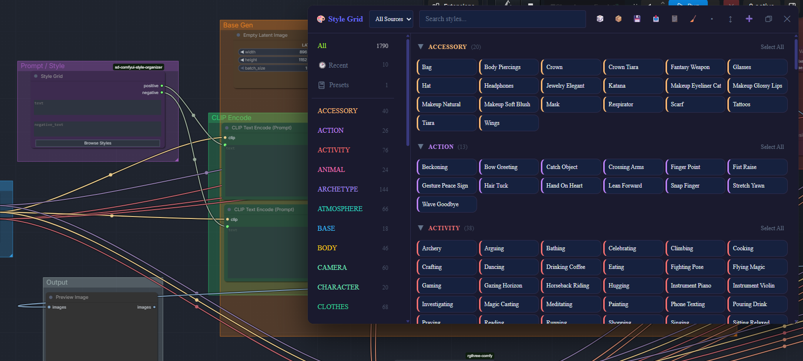

- Search and category filtering across your style packs
- Multi-select with conflict detection
- Favorites and recently used
- Presets: save and load groups of styles at once
- Create, edit, duplicate, and delete styles from the grid
- Move styles between categories
- Thumbnail previews with manual upload
- Import and export your styles and presets, with automatic backup
- Wildcard support: `{sg:category}` resolves to a random style from that category at generation time

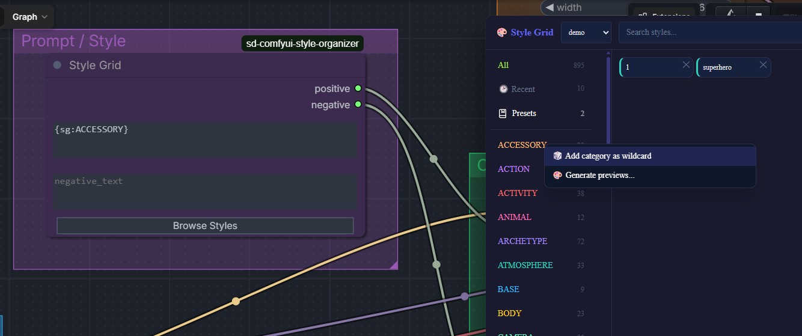

Right-click any category header and choose "Add category as wildcard"
to insert `{sg:category}` into the active text field — it resolves to
a random style from that category each time the workflow runs.

- Works with multiple CSV sources at once, or filtered to one

## Installation

Clone into your `custom_nodes` folder:

```bash
cd ComfyUI/custom_nodes
git clone https://github.com/KazeKaze93/sd-comfyui-style-organizer
```

Restart ComfyUI. The Style Grid node will be available under the node search.

(Once published to the ComfyUI Registry, this section will be updated with a Manager install option.)

## Usage

Add the **Style Grid** node to your workflow. It outputs two STRING values, positive and negative, meant to feed directly into your text encode nodes. Click **Browse Styles** to open the grid, search or browse by category, and apply styles to the node's text fields directly.

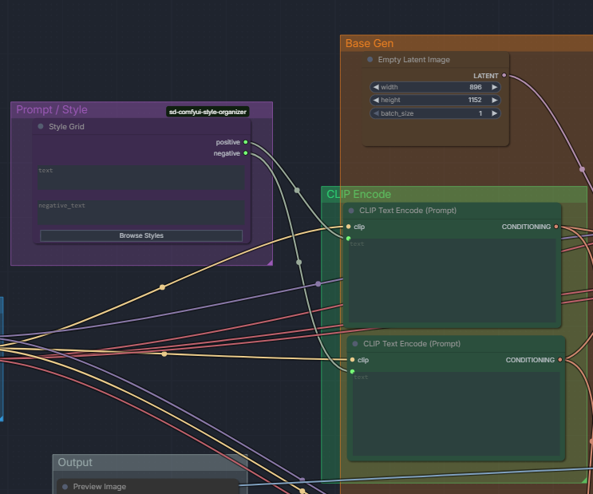

The two STRING outputs feed directly into your text encode nodes'
`text` inputs — right-click those nodes and choose "Convert text to
input" if they don't already show a socket.

## Working with styles

Right-click any style card for Edit, Duplicate, Move to category,
Upload preview image, and Delete.

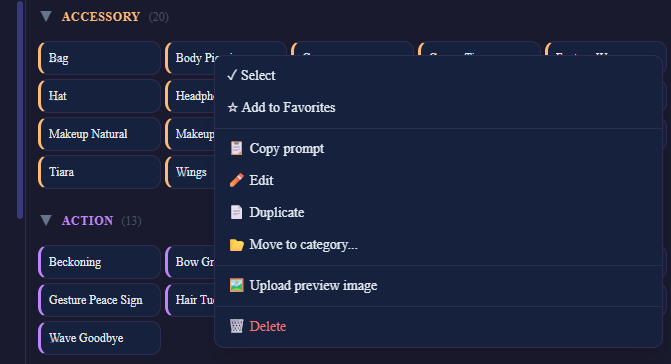

**Edit** opens a form for the style's description, category, prompt,
and negative prompt (the name itself isn't editable here — renaming is
Duplicate-then-delete-the-original, kept separate to avoid orphaning
CSV rows).

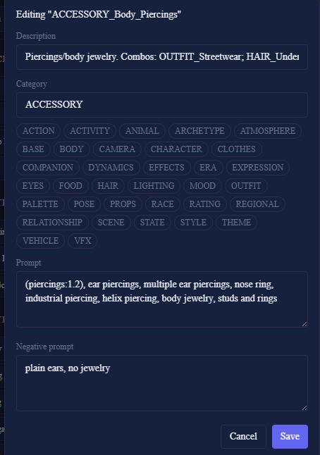

**Move to category** offers existing categories as quick-pick chips.

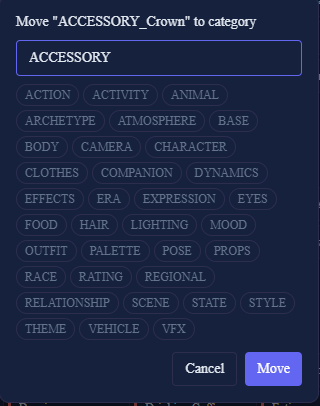

**Duplicate** works on any style, including ones from the read-only
sample pack — it's the way to turn a demo style into your own editable
copy. Edit, Move, and Delete are blocked on styles from `samples/`:

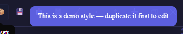

**Presets** let you save and reload a set of selected styles at once.
Clicking an already-loaded preset unloads it.

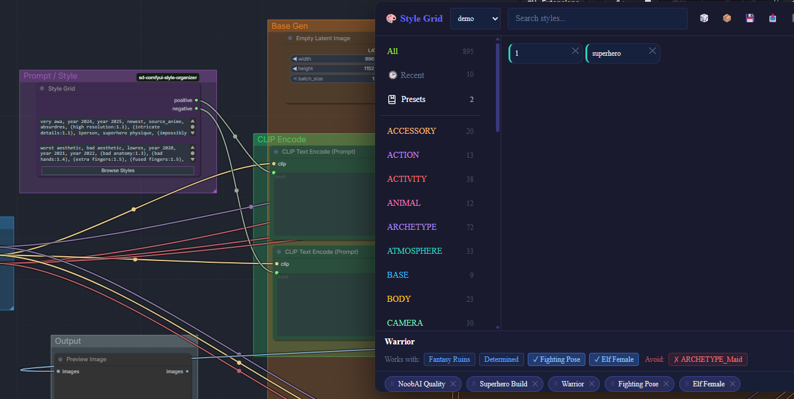

**Import/Export** backs up or shares your styles and presets as a
single file.

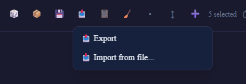

**Search** with autocomplete suggestions as you type:

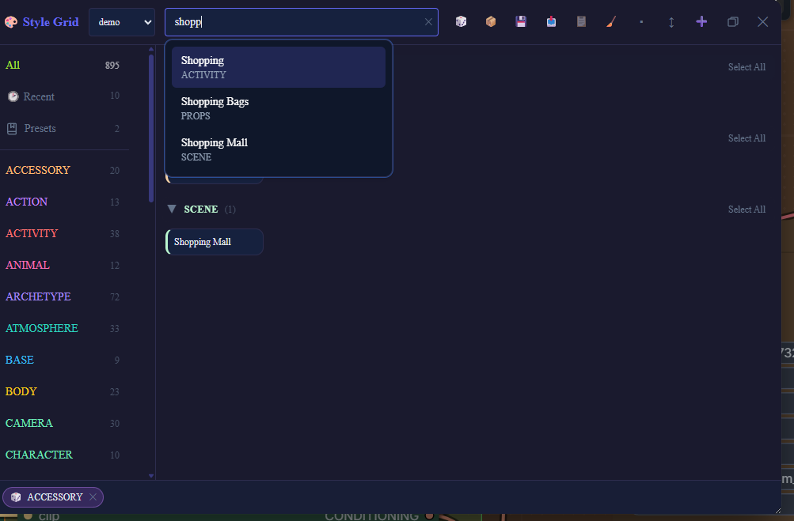

**Thumbnails** show on hover once uploaded via the card menu:

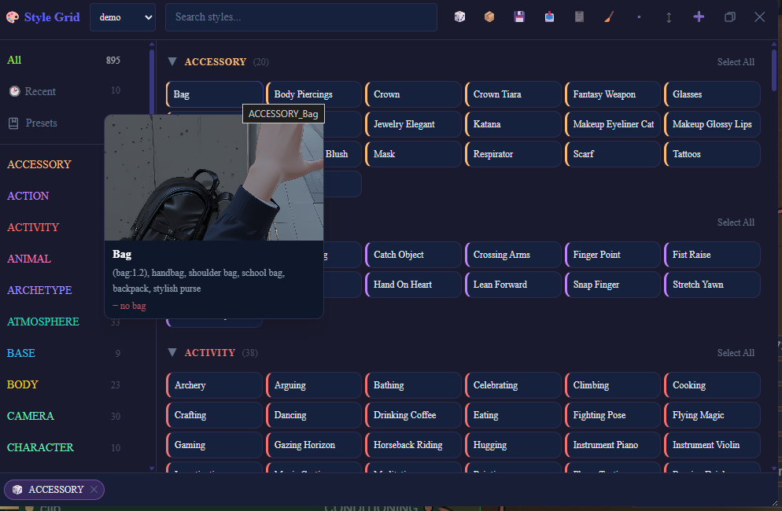

The panel supports fullscreen for browsing large packs:

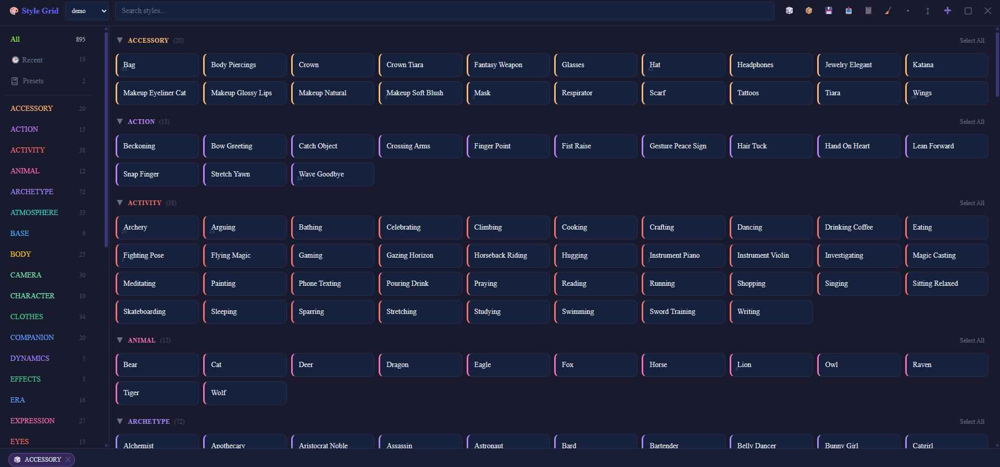

## Style packs

Style Grid ships with one small sample pack (`demo.csv`) so the grid isn't empty on first install. Full style packs are distributed separately on [CivitAI](https://civitai.com/models/2409619/sfw-prompt-pack). Drop CSV files into the node's `data/` folder to add more.

## BREAK and prompt chunking

Style Grid does not insert or manage `BREAK` tokens itself. If your styles or prompts use `BREAK`, ComfyUI's built-in CLIP Text Encode node treats it as a literal word rather than a chunk separator. Use a BREAK-aware text encoder such as [CLIPTextEncodeBREAK](https://github.com/pamparamm/ComfyUI-ppm) if you rely on BREAK in your prompts.

## Generated files and cleanup

Style Grid writes runtime data under `data/` inside the extension
folder:

| Path | What it is | Safe to delete? |
|------|-----------|------------------|
| `data/*.csv` | Your own style packs (created via New style, or Duplicate/Move/Edit on non-protected styles) | Only if you don't need them — this is your data |
| `data/imports/*.csv` | Style packs created by the Import feature | Yes, anytime |
| `data/backups/` | CSV backup snapshots (created by the Backup button) | Yes, oldest are auto-pruned past 20 |
| `data/presets.json` | Saved presets | Only if you don't need them |
| `data/usage.json` | Local usage counters (which styles you click most) | Yes, purely informational |
| `data/thumbnails/` | Uploaded/generated preview images | Yes, previews just won't show until re-uploaded |

`samples/styles_sfw.csv` (the bundled demo pack) is read-only by
design — Edit, Move, and Delete are blocked on styles from this file.
Use Duplicate to create an editable copy in `data/` first.

## License

AGPL-3.0. See [LICENSE](LICENSE).
