# Style Grid for ComfyUI

Searchable, categorized visual card grid for browsing and applying prompt styles in ComfyUI. A ComfyUI node port of the [WebUI extension](https://github.com/KazeKaze93/sd-webui-style-organizer) with the same idea: search, favorites, presets, and a visual grid instead of a flat dropdown.

## Features

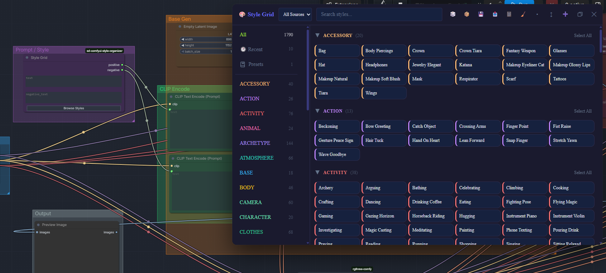

- Search and category filtering across your style packs
- Multi-select with conflict detection
- Favorites and recently used
- Presets: save and load groups of styles at once
- Create, edit, duplicate, and delete styles from the grid
- Move styles between categories
- Thumbnail previews with manual upload
- Import and export styles, presets, and usage as JSON
- Manual Backup: zip snapshot of `data/` + `imports/` CSVs and presets under `data/backups/`
- Wildcard support: `{sg:category}` picks a random style from that category at node execution; `{sg:category:spec}` limits the pool to a slice (include / exclude / glob)

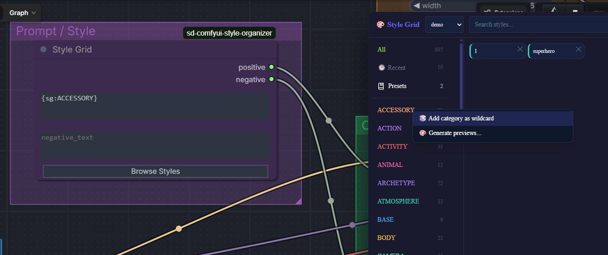

Right-click a category in the **sidebar** for wildcard actions:

| Item | What it does |
|---|---|
| **Add category as wildcard** | Inserts `{sg:<category>}` into the active text field |
| **Select styles for wildcard…** | Opens slice-selection mode: tick styles (search and source filter still apply; **Select all** covers the currently visible list). **Add as wildcard** inserts a compact `{sg:<category>:<spec>}` for that selection |

**How `{sg:…}` works**

- **Whole category:** `{sg:body}` — category match is case-insensitive
- **Slice:** `{sg:body:Tanned,Shortstack}` — comma-separated **suffixes without the category prefix** (not `BODY_Tanned`). Leading `-` excludes (`{sg:body:-Tanned}`); trailing `*` is a prefix glob (`{sg:body:Male_*}`)
- **Resolution:** includes are unioned, then excludes subtract. If every listed name is missing, the token **falls back to the whole category** instead of vanishing. The UI writes the shortest correct form; the resolver understands all forms
- **When / what:** expanded when the Style Grid node runs. A wildcard in the positive field pulls the style’s `prompt`; in the negative field it pulls `negative_prompt`
- **Source filter:** a specific CSV limits the pool to that pack; All Sources uses the merged library
- **Unknown category:** the raw token is left in place through nested passes, then stripped with a warning

You can also type or paste `{sg:…}` tokens by hand.

- Works with multiple CSV sources at once, or filtered to one

## Installation

**Via ComfyUI-Manager (recommended):**

Open ComfyUI-Manager → Custom Nodes Manager → search "Style Grid" →
Install. Restart ComfyUI when prompted.

**Manual / development install:**

```bash
cd ComfyUI/custom_nodes
git clone https://github.com/KazeKaze93/sd-comfyui-style-organizer
```

Restart ComfyUI. The Style Grid node will be available under the node search.

Updates: Manager installs update through Manager's own Update /
Check for updates flow. Manual git installs update via `git pull`
inside the extension folder.

## Usage

Add the **Style Grid** node to your workflow. It outputs two STRING values, positive and negative, meant to feed directly into your text encode nodes. Click **Browse Styles** to open the grid, search or browse by category, and apply styles to the node's text fields directly.

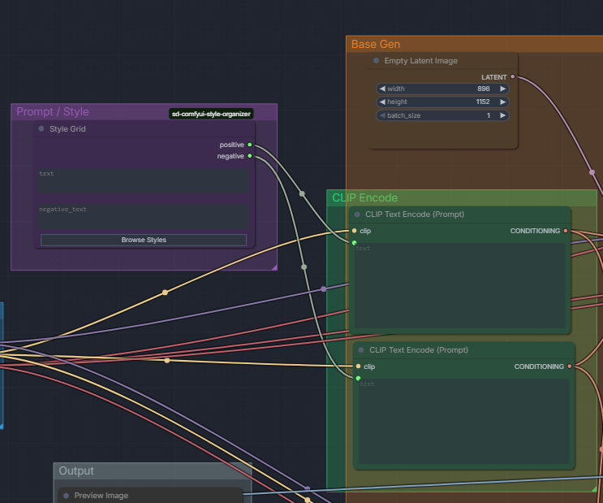

The two STRING outputs feed directly into your text encode nodes'
`text` inputs — right-click those nodes and choose "Convert text to
input" if they don't already show a socket.

## Working with styles

Right-click any style card for Edit, Duplicate, Move to category,
Upload preview image, and Delete.

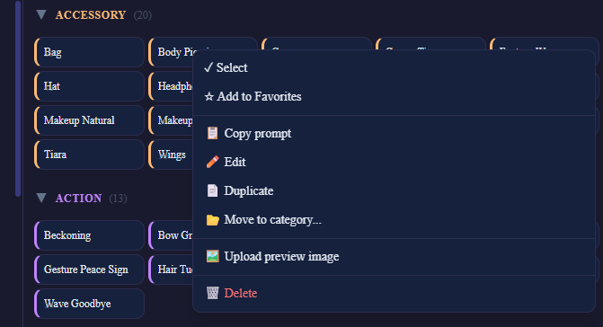

**Edit** opens a form for the style's description, category, prompt,
and negative prompt (the name itself isn't editable here — renaming is
Duplicate-then-delete-the-original, kept separate to avoid orphaning
CSV rows).

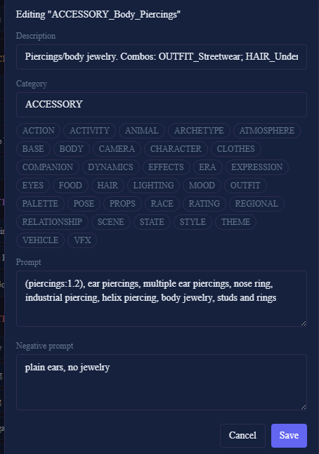

**Move to category** offers existing categories as quick-pick chips.

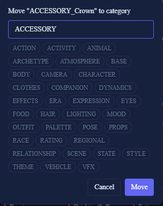

**Duplicate** works on any style, including ones from the read-only
sample pack — it's the way to turn a demo style into your own editable
copy. Edit, Move, and Delete are blocked on styles from `samples/`:

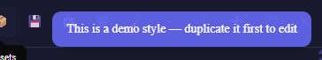

**Presets** let you save and reload a set of selected styles at once.
Clicking an already-loaded preset unloads it.

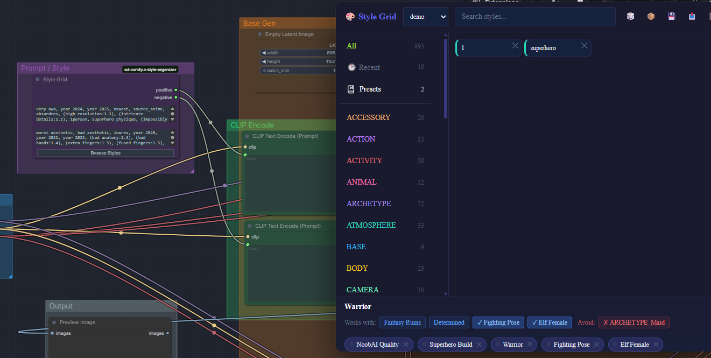

**Import/Export** shares your styles, presets, and usage as a single
JSON file. Import can also restore a Backup zip (CSVs + presets).

**Backup** (toolbar diskette) writes a manual zip snapshot of your
`data/` and `data/imports/` CSVs plus `presets.json` into
`data/backups/` (bundled `samples/` is excluded). It is not automatic,
and it is separate from Export.

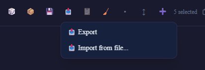

**Search** with autocomplete suggestions as you type:

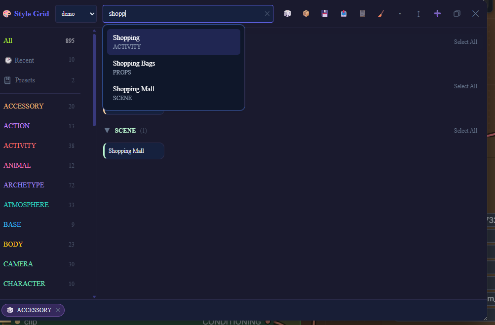

**Thumbnails** show on hover once uploaded via the card menu:

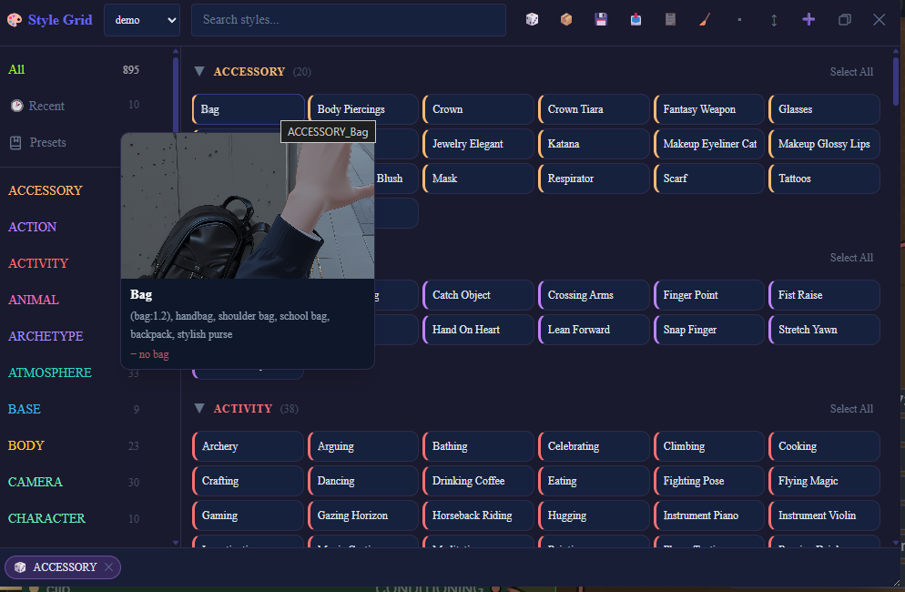

The panel supports fullscreen for browsing large packs:

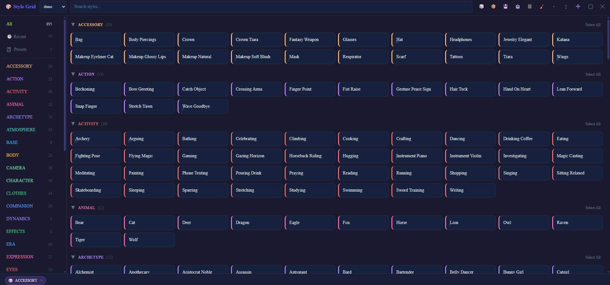

## Style packs

Style Grid ships with one small sample pack (`demo.csv`) so the grid isn't empty on first install. Full style packs are distributed separately on [CivitAI](https://civitai.com/models/2409619/sfw-prompt-pack). Drop CSV files into the node's `data/` folder to add more.

## BREAK and prompt chunking

Style Grid does not insert or manage `BREAK` tokens itself. If your styles or prompts use `BREAK`, ComfyUI's built-in CLIP Text Encode node treats it as a literal word rather than a chunk separator. Use a BREAK-aware text encoder such as [CLIPTextEncodeBREAK](https://github.com/pamparamm/ComfyUI-ppm) if you rely on BREAK in your prompts.

## Generated files and cleanup

Style Grid writes runtime data under `data/` inside the extension
folder:

| Path | What it is | Safe to delete? |
|------|-----------|------------------|
| `data/*.csv` | Your own style packs (created via New style, or Duplicate/Move/Edit on non-protected styles) | Only if you don't need them — this is your data |
| `data/imports/*.csv` | Style packs created by the Import feature (including restore from a Backup zip) | Yes, anytime |
| `data/backups/` | Manual Backup `.zip` archives (`data/` + `imports/` CSVs + `presets.json`; Backup button). Oldest auto-pruned past 20 | Yes |
| `data/presets.json` | Saved presets | Only if you don't need them |
| `data/usage.json` | Local usage counters (which styles you click most) | Yes, purely informational |
| `data/category_order.json` | Persisted sidebar category order | Yes — order falls back to defaults |
| `data/thumbnails/` | Uploaded preview images | Yes, previews just won't show until re-uploaded |

`samples/demo.csv` (the bundled demo pack) is read-only by
design — Edit, Move, and Delete are blocked on styles from this file.
Use Duplicate to create an editable copy in `data/` first.

## Development

Python tests (resolver / slice grammar) and UI tests (compactor + parity) run in CI on push and pull request to `master`.

```bash
# Python (from repo root; needs pytest)
python -m pytest tests/ -v

# UI (from ui/)
npm ci
npm test
npx tsc --noEmit -p tsconfig.app.json
npx tsc --noEmit -p tsconfig.node.json
npx tsc --noEmit -p tsconfig.test.json
npm run lint

# Rebuild the committed panel bundle into web/ui/
npm run build
```

## License

AGPL-3.0. See [LICENSE](LICENSE).
